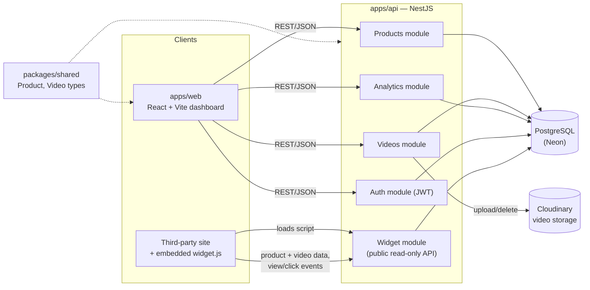

# shelflife

A monorepo for managing products and their promotional videos, with view/click analytics
and an embeddable widget for showcasing product videos on third-party sites.

## Apps and packages

- [apps/web](apps/web) — React + Vite dashboard for managing products, videos, and analytics
- [apps/api](apps/api) — NestJS REST API (products, videos, analytics, auth, widget)
- [packages/shared](packages/shared) — Shared TypeScript types (`Product`, `Video`) used by both apps
- [packages/widget](packages/widget) — Embeddable widget script (`widget.js`) that third-party sites load to show a product's videos

## Architecture



- The **web dashboard** talks to the API via Products/Videos/Analytics/Auth over normal authenticated REST calls.
- The **embeddable widget** (`packages/widget/widget.js`) is a self-contained script a merchant drops into their own site (see [apps/web/public/demo.html](apps/web/public/demo.html) for a live example). It fetches a product's videos from the API's public `/widget` endpoints and reports view/click events back — those routes get an open CORS policy since they run on arbitrary third-party origins (see [apps/api/src/main.ts](apps/api/src/main.ts)).
- All modules persist through **Prisma** to a **PostgreSQL** database (hosted on [Neon](https://neon.tech)). **Cloudinary** stores the actual video files; the API only stores the resulting URLs/metadata.
- `packages/shared` holds the `Product`/`Video` TypeScript types consumed by both the API and the web app so their shapes can't drift.

Auth (JWT register/login) is implemented on the backend, but no routes are guarded yet — see [Shelflife_Roadmap.md](Shelflife_Roadmap.md).

## Getting started

The API needs a PostgreSQL database and Cloudinary credentials — see [apps/api/README.md](apps/api/README.md) for env setup before running it the first time.

Install dependencies from the repo root:

```bash
pnpm install
```

Run both the API and web app together:

```bash
pnpm dev
```

Or run them individually:

```bash
pnpm dev:api   # NestJS API on http://localhost:3000
pnpm dev:web   # Vite dev server on http://localhost:5173
```

See each app's README for more details:

- [apps/web/README.md](apps/web/README.md)
- [apps/api/README.md](apps/api/README.md)

## Tooling

- [pnpm workspaces](pnpm-workspace.yaml) manage the `apps/*` and `packages/*` packages
- TypeScript project references are configured in the root [tsconfig.json](tsconfig.json)
